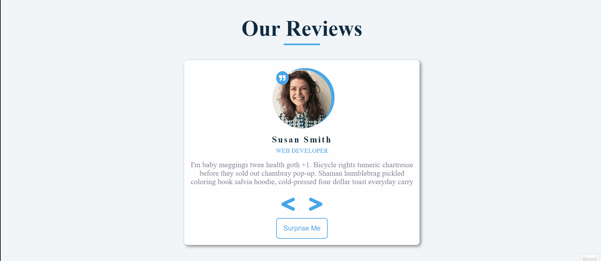

# 15 Vanilla JavaScript Projects

This project is a part of 15 vanilla JavaScript projects.

## Table of contents

- [Overview](#overview)
  - [Screenshot](#screenshot)
  - [Links](#links)
- [My process](#my-process)
  - [Built with](#built-with)
  - [What I learned](#what-i-learned)
  - [Resources](#resources)
- [Author](#author)

## Overview

### Screenshot



### Links

- [View live](https://junaidshaikh-js.github.io/reviews/)

## My process

### Built with

- Semantic HTML5 markup
- [Sass](https://sass-lang.com/) - CSS extension language
- CSS Flexbox
- JavaScript

### What I learned

- In this project, I learned about showing next or previous reviews when the user click on the next or previous button respectively.

- I also learned about a new CSS property - `object-fit`

  ```css
  .author-image {
    position: relative;
    object-fit: cover;
  }
  ```

  `object-fit` property is used to specify how the image or video should be resized to fit to its container.

### Resources

- [MDN article for object-fit property](https://developer.mozilla.org/en-US/docs/Web/CSS/object-fit)

## Author

- Linkedin - [@junaidshaikhjs](https://www.linkedin.com/in/junaidshaikhjs/)
- Twitter - [@junaidshaikh_js](https://twitter.com/junaidshaikh_js)
